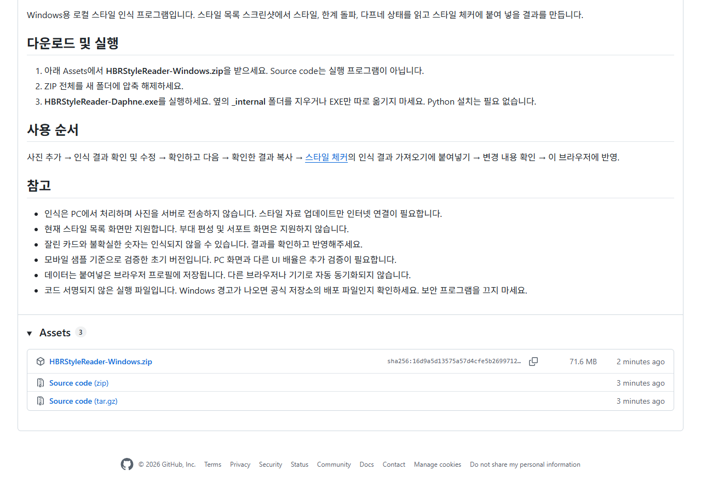
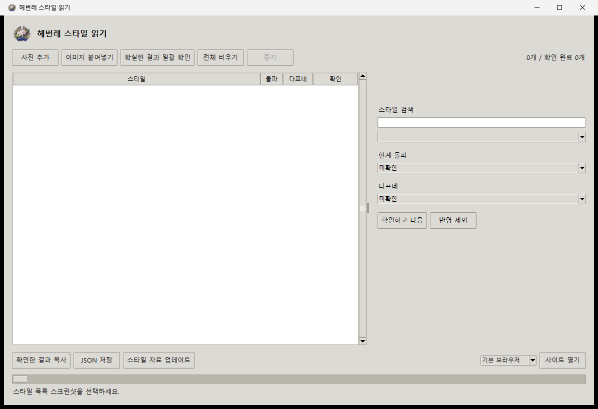
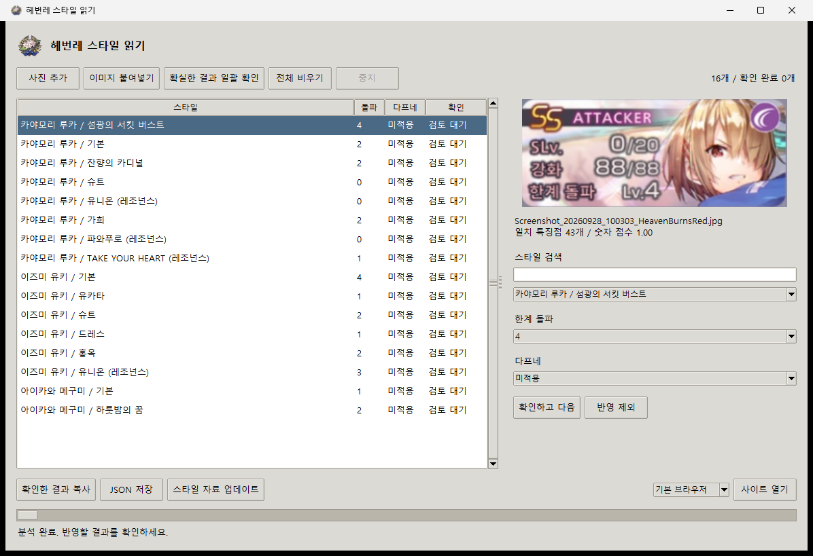
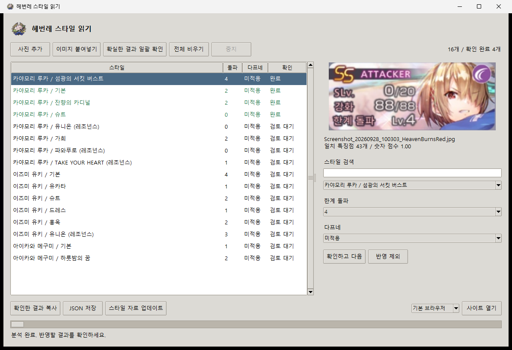
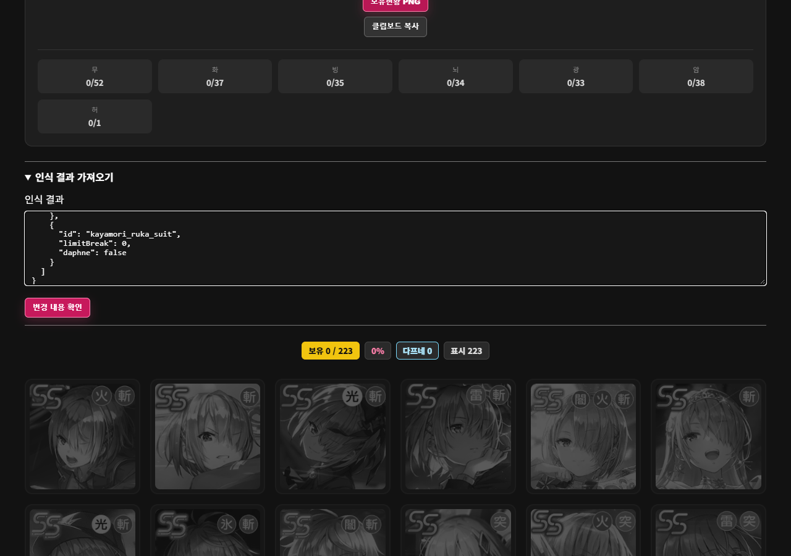
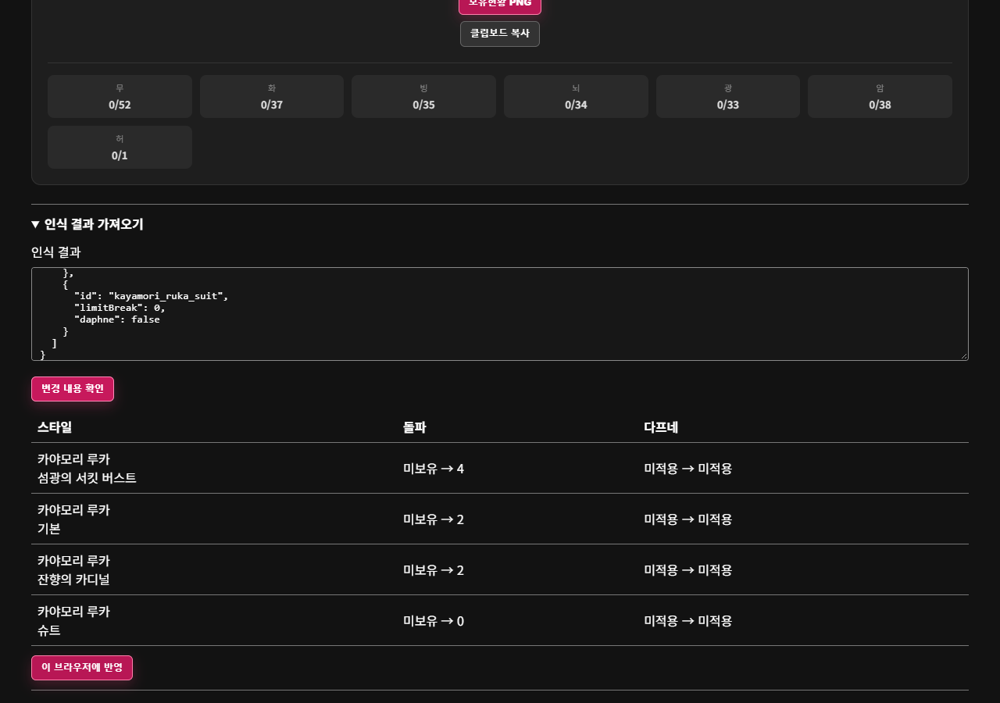
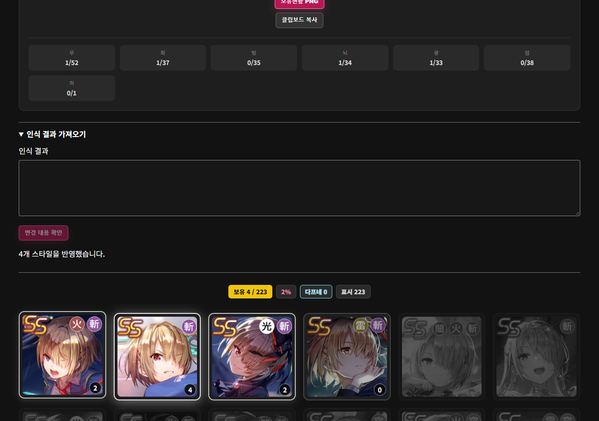

# [배포] 스크린샷으로 스타일·돌파·다프네를 입력하는 헤번레 스타일 읽기

스타일 체커에서 보유 스타일을 하나씩 누르기 번거로워서, 게임 스크린샷을 읽는 Windows 프로그램을 만들었습니다.

게임의 **스타일 목록** 화면을 넣으면 스타일, 한계 돌파 수, 다프네 여부를 인식합니다. 결과를 확인하고 복사해서 스타일 체커에 붙여넣으면 됩니다.

사진 분석은 내 PC에서 처리합니다. 사진을 외부 서버에 보내지 않으며, AI API 사용료도 없습니다. 현재는 **시험 배포 버전**이라 인식 결과를 확인한 뒤 반영해주세요.

## 1. 다운로드 및 실행

- **[Windows 프로그램 ZIP 다운로드](https://github.com/woochang222/hbr-syltchecker/releases/download/reader-v0.1.1/HBRStyleReader-Windows.zip)** (v0.1.1, 약 75MB)
- [배포 페이지 및 변경 사항](https://github.com/woochang222/hbr-syltchecker/releases/tag/reader-v0.1.1)
- [헤번레 스타일 체커](https://woochang222.github.io/hbr-syltchecker/)

GitHub 로그인 없이 다운로드할 수 있습니다. 배포 페이지에서 받을 때는 **Assets → HBRStyleReader-Windows.zip**을 선택하세요. `Source code`는 실행 프로그램이 아닙니다.

ZIP 파일의 **압축을 전부 해제**한 뒤, 폴더 안의 **HBRStyleReader-Daphne.exe**를 실행해주세요. 다프네 문양이 붙어 있는 실행 파일입니다. Python을 따로 설치할 필요는 없습니다.

**옆에 있는 `_internal` 폴더가 꼭 필요합니다.** EXE만 따로 옮기거나 ZIP 안에서 바로 실행하지 마세요.

코드 서명되지 않은 초기 배포 파일이라 Windows에서 경고가 나올 수 있습니다. 위 공식 저장소에서 받은 파일인지 확인해주세요. 실행을 위해 백신을 끄거나 검사 예외를 추가하지 마세요.

## 2. 게임 스크린샷 준비

게임에서 **스타일 목록**을 열어 가로 카드들이 보이도록 캡처합니다. 휴대폰에서 찍었다면 사진 파일을 PC로 옮겨주세요.

- 스타일 그림과 **한계 돌파 Lv. 숫자**가 모두 보여야 합니다.
- 목록을 내려가며 여러 장 찍어도 됩니다. 앞 사진과 일부 카드가 겹쳐도 괜찮습니다.
- 위아래가 잘린 카드는 처리하지 않으므로 다음 사진에 온전히 나오게 찍어주세요.
- 현재는 카드가 최소 **3열·2행 이상** 보이는 목록 화면을 기준으로 인식합니다.
- **부대 편성 화면과 서포트 카드는 지원하지 않습니다.**

모바일 스크린샷을 기준으로 개발했습니다. PC 화면, 다른 배율이나 낮은 화질에서는 인식이 잘되지 않을 수 있습니다. 가능한 한 원본 화질을 사용해주세요.

## 3. 사진 추가

프로그램의 **사진 추가**를 눌러 준비한 사진을 선택합니다. 여러 장을 한 번에 선택할 수 있습니다. 클립보드에 이미지가 있다면 **이미지 붙여넣기**도 가능합니다.

## 4. 인식 결과 확인

분석이 끝나면 왼쪽에 스타일 목록이 표시됩니다. 항목을 누르면 오른쪽에서 원본 카드와 인식 결과를 비교할 수 있습니다.

스타일이 다르면 **스타일 검색**에서 찾아 바꾸고, **한계 돌파**와 **다프네** 값도 확인해주세요. 수정 후 **확인하고 다음**을 누르면 해당 항목이 완료로 바뀝니다.

빠르게 처리하려면 **확실한 결과 일괄 확인**을 사용할 수 있습니다. 다만 이 기능도 정답을 보장하지 않으니 원본과 비교해주세요. 잘못 읽은 항목을 빼려면 **반영 제외**를 누릅니다.

숫자나 다프네가 **미확인**이면 해당 값은 웹의 기존 값을 유지합니다. 돌파와 다프네가 모두 미확인인 항목은 적어도 하나를 확인하거나 반영에서 제외해주세요.

## 5. 확인한 결과 복사

반영할 항목을 확인했다면 아래의 **확인한 결과 복사**를 누릅니다. 확인하지 않은 항목은 복사되지 않습니다.

v0.1.1부터 **이미 확인 완료한 스타일은 사진을 추가해도 다시 목록에 넣지 않습니다.** 기존 확인값을 유지하며, 새 사진과 값이 다르면 분석 완료 메시지에 표시합니다. 변경이 필요하면 기존 항목을 선택해 수정해주세요.

미확인 항목도 스타일·돌파·다프네 값이 모두 같으면 중복을 건너뜁니다. 아직 확인하지 않은 같은 스타일의 값이 서로 다르면 개별 검토를 위해 남깁니다. 서로 다른 값을 모두 확인하면 복사가 중단되므로 값을 맞추거나 중복 항목을 제외해주세요.

## 6. 웹에 붙여넣기

평소 스타일 체커를 사용하던 브라우저로 [스타일 체커](https://woochang222.github.io/hbr-syltchecker/)를 엽니다. 프로그램 오른쪽 아래에서 기본 브라우저·크롬·엣지를 선택하고 **사이트 열기**를 눌러도 됩니다.

웹의 **인식 결과 가져오기**를 펼친 뒤 입력칸에 복사한 내용을 붙여넣습니다. 사진이 아니라 **프로그램에서 복사한 결과 텍스트**를 붙여넣는 것입니다.

**변경 내용 확인**을 누르면 반영 전후의 돌파·다프네 값을 볼 수 있습니다. 내용이 맞으면 **이 브라우저에 반영**을 누릅니다.

사진에 없거나 복사 결과에 포함되지 않은 스타일은 그대로 유지됩니다. 다만 포함된 항목은 확인한 새 값으로 바뀌므로, 예전 사진으로 현재보다 낮은 돌파 수를 덮어쓰지 않도록 주의해주세요.

## 7. 새 스타일이 추가되면

프로그램 아래의 **스타일 자료 업데이트**를 누르세요. 제작자가 GitHub에 게시한 최신 인식 자료를 받습니다. 게임에 출시됐다고 즉시 인식되는 것은 아니며, 자료가 먼저 등록되어야 합니다.

자료를 받을 때는 인터넷이 필요하지만, 받은 자료로 사진을 분석할 때는 인터넷이 없어도 됩니다. **인식 자료 업데이트와 프로그램 업데이트는 별개**입니다. 기능 수정 버전은 새 ZIP을 받아 새 폴더에 압축 해제해서 실행해주세요.

## 자주 묻는 질문

**크롬에서 반영했는데 엣지에는 없어요.**

보유 정보는 붙여넣은 브라우저의 해당 프로필에 저장됩니다. 다른 브라우저·프로필·기기로 자동 동기화되지 않습니다. 브라우저의 사이트 데이터를 삭제하면 저장 내용도 지워질 수 있습니다.

**게임 계정에도 적용되나요?**

아니요. 게임에는 접근하지 않으며 웹 스타일 체커의 보유 표시만 갱신합니다.

**사진을 추가했는데 결과가 없어요.**

부대 화면이 아닌 스타일 목록인지, 카드가 온전히 보이는지 확인해주세요. 사진이 작거나 흐리다면 원본으로 다시 시도해주세요.

**새 스타일을 못 읽어요.**

스타일 자료 업데이트 후 다시 분석해주세요. 아직 자료가 등록되지 않았거나 판독이 어려우면 직접 선택하거나 이번 반영에서 제외할 수 있습니다.

**복사가 안 돼요.**

확인 완료된 항목이 있는지, 스타일이 선택되어 있는지, 중복 결과가 충돌하지 않는지 확인해주세요. 돌파와 다프네가 모두 미확인인 행도 복사를 막습니다.

잘못 읽는 경우에는 사용한 화면 종류와 증상을 알려주세요. 스크린샷을 첨부할 때는 계정 정보나 개인정보가 나오지 않는지 확인 부탁드립니다.
